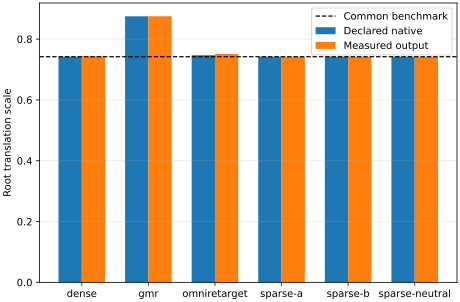
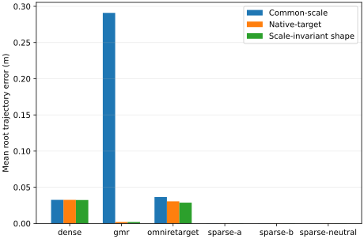
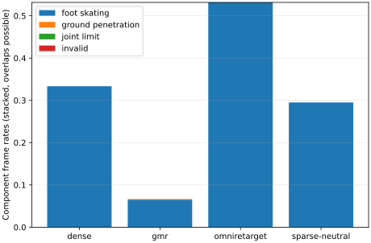

# Human-to-G1 Retargeting Pilot Report

## Abstract

**Revision status:** the legacy four-method execution below is complete, but
the revised Stage 1 is not. ProtoMotions v2.3/v3, pre-solver policy capture,
the controlled scale-policy transplant, and registered root/local sensitivity
runs remain mandatory. Current decision: `NO-GO — revised Stage 1 work in
progress`.

This Stage 1 Pilot compares controlled Sparse and Dense Mink retargeting, official GMR, and official OmniRetarget/Holosoma on the source-only-selected 600-frame (`19.9998 s`) LAFAN1 window `dance1_subject1_f000000_000600`. The original presentation made several methods look nearly identical because it mixed method-specific root scales with a method-dependent evaluator scale and used root-frame plots that intentionally remove global translation. Evaluator v2 fixes that confound without changing the sequence, methods, or thresholds: one neutral-G1/source landmark scale is frozen for all quality metrics, native scale policy and scale-invariant path shape are reported separately, and controlled baseline v3 uses that common scale, a geometry-derived rigid root anchor, and an explicit weak temporal cost.

## Frozen design and scope

The legacy evidence contains one LAFAN Pilot, three Sparse seeds, four completed operating points, and the two official box/climb interaction cases in Full and No-Hard form. Revised Stage 1 additionally requires ProtoMotions v2.3 and v3 plus the registered preprocessing/scale study. It is not a Full-LAFAN ranking. The official public methods retain their native scaling policies; they are not silently rescaled or retuned. The evaluator uses the Holosoma G1 29-DoF model only as common robot geometry and joint order.

## Main results

| label          |   rf_kpe_all_mean_m |   rf_kpe_targeted_mean_m |   rf_kpe_untracked_mean_m |   root_translation_common_scale_mean_m |   root_yaw_mean_rad |   artifact_rate |
|:---------------|--------------------:|-------------------------:|--------------------------:|---------------------------------------:|--------------------:|----------------:|
| dense          |              0.0867 |                   0.0303 |                    0.1056 |                                 0.0326 |              0.0911 |          0.3333 |
| gmr            |              0.1162 |                   0.0997 |                    0.1217 |                                 0.2909 |              0.0422 |          0.0667 |
| omniretarget   |              0.1077 |                   0.0838 |                    0.1156 |                                 0.0365 |              0.0318 |          0.5317 |
| sparse-neutral |              0.1004 |                   0.0064 |                    0.1318 |                                 0.0002 |              0.0095 |          0.2950 |

`dense` has the lowest RF-KPE-all and `sparse-neutral` has the lowest median end-to-end RTF at this one operating point. Neither observation is a dataset-level ranking. The visual similarity is expected: every output is the same G1 morphology, all methods track overlapping major body landmarks, and RF-KPE removes root position and heading before comparing pose. Differences are most visible in the disaggregated root-scale, task-residual, temporal, artifact, and seed-sensitivity evidence below.

## Scale audit: why root translation looked inconsistent

The common benchmark scale is `0.742037044`, obtained once from neutral G1 `head→mean(toes)` divided by source frame-0 `Head→mean(toes)`. It is not inferred from any method output. Controlled v3 additionally applies the single rigid translation `[0.977229, -1.410371, 0.112782] m`, defined as neutral-G1 pelvis minus scaled source frame-0 pelvis. This anchor changes only world placement; it does not alter scale, root-path deltas, or RF-KPE. It removes the artificial ground penetration caused by placing G1's longer pelvis-to-foot chain at the scaled human pelvis height.

| label          |   common_static_scale |   native_root_scale |   effective_root_xy_scale |   root_translation_common_scale_mean_m |   root_translation_native_scale_mean_m |   root_translation_scale_invariant_mean_m |
|:---------------|----------------------:|--------------------:|--------------------------:|---------------------------------------:|---------------------------------------:|------------------------------------------:|
| dense          |                0.7420 |              0.7420 |                    0.7435 |                                 0.0326 |                                 0.0326 |                                    0.0324 |
| gmr            |                0.7420 |              0.8750 |                    0.8750 |                                 0.2909 |                                 0.0020 |                                    0.0020 |
| omniretarget   |                0.7420 |              0.7471 |                    0.7511 |                                 0.0365 |                                 0.0305 |                                    0.0288 |
| sparse-a       |                0.7420 |              0.7420 |                    0.7420 |                                 0.0002 |                                 0.0002 |                                    0.0002 |
| sparse-b       |                0.7420 |              0.7420 |                    0.7420 |                                 0.0002 |                                 0.0002 |                                    0.0002 |
| sparse-neutral |                0.7420 |              0.7420 |                    0.7420 |                                 0.0002 |                                 0.0002 |                                    0.0002 |

Three quantities answer three different questions:

- **Common-scale error** asks whether the output follows the morphology-referenced benchmark trajectory.
- **Native-scale error** asks whether the public solver follows the trajectory implied by its own declared policy.
- **Scale-invariant error** fits one scalar to the root XY path and asks only whether path shape is preserved.

GMR's declared root/leg policy is `0.9 × 1.75 / 1.8 = 0.875`; Holosoma's LAFAN default is `1.27 / 1.7 = 0.7470588`. The old evaluator also estimated robot height from each method's first output pose, which made the reference itself method-dependent. These are the reasons identical source and target robot did not produce identical root scales. A large common-scale error together with a small native or scale-invariant error is scale-policy mismatch, not necessarily solver tracking failure.

## RF-KPE: what it measures and why values cluster

RF-KPE is **root-frame keypoint position error**. Human semantic joints are scaled with the one common scale, translated relative to the human root, and rotated into the geometry-derived human heading; G1 semantic points are treated the same way using the robot root. It therefore evaluates relative whole-body pose while deliberately excluding root translation and root yaw. `targeted` covers wrists and ankles; `untracked` covers the remaining semantic body joints. Similar RF-KPE values do not imply identical trajectories: common robot morphology imposes a shared error floor, and the metric cannot expose the scale differences that were removed by root alignment. Root translation/yaw, declared task residuals, and artifacts must be read beside it.

## Sparse versus Dense design

For the neutral-seed operating-point comparison, Sparse and Dense v3 share the same G1 model, common uniform scale, rigid frame-0 root anchor, DAQP solver, damping, joint limits, iteration budget, first-frame convergence budget, posture cost, weak `q[t-1]` temporal cost, root weights, and sequential warm start. Only the declared task set differs. Sparse tracks root translation/yaw plus left/right wrists and ankles. Dense adds torso, head, shoulders, elbows, hips, knees, and toes. No hand/foot orientation, contact prior, learned prior, or independent-frame variant enters the main comparison.

| label          |   root_position_residual_mean_m |   root_position_residual_p95_m |   four_ee_position_residual_mean_m |   four_ee_position_residual_p95_m |   dense_added_position_residual_mean_m |   all_declared_position_residual_mean_m |
|:---------------|--------------------------------:|-------------------------------:|-----------------------------------:|----------------------------------:|---------------------------------------:|----------------------------------------:|
| sparse-neutral |                         0.00016 |                        0.00077 |                            0.00486 |                           0.01489 |                                0.00000 |                                 0.00392 |
| sparse-a       |                         0.00016 |                        0.00077 |                            0.00490 |                           0.01487 |                                0.00000 |                                 0.00395 |
| sparse-b       |                         0.00015 |                        0.00073 |                            0.00484 |                           0.01489 |                                0.00000 |                                 0.00391 |
| dense          |                         0.00858 |                        0.01510 |                            0.01610 |                           0.03280 |                                0.10105 |                                 0.07562 |

These are the actual world-position residuals minimized by the controlled solver. They are reported separately from RF-KPE, which is an evaluator-side morphology metric. Dense has more mutually competing position targets on a robot with different segment proportions, so lower full-body RF-KPE can coexist with higher declared-task residual and root-path error; that trade-off is part of the result, not a scale inconsistency.

## Temporal and artifact evidence

| label          |   joint_velocity_rms_mean_rad_s |   joint_acceleration_rms_mean_rad_s2 |   joint_jerk_rms_p95_rad_s3 |   pose_jump_p95_m |
|:---------------|--------------------------------:|-------------------------------------:|----------------------------:|------------------:|
| dense          |                          0.5734 |                               8.3957 |                   1360.1751 |            0.0364 |
| gmr            |                          0.8623 |                              15.4489 |                   1796.9077 |            0.0433 |
| omniretarget   |                          0.5893 |                               7.4100 |                    604.0731 |            0.0383 |
| sparse-neutral |                          0.4338 |                               5.7591 |                    802.8773 |            0.0380 |

| label          |   foot_skating_frame_rate |   ground_penetration_frame_rate |   joint_limit_violation_frame_rate |   invalid_frame_rate |   artifact_rate |
|:---------------|--------------------------:|--------------------------------:|-----------------------------------:|---------------------:|----------------:|
| dense          |                    0.3333 |                          0.0000 |                             0.0000 |               0.0000 |          0.3333 |
| gmr            |                    0.0650 |                          0.0017 |                             0.0000 |               0.0000 |          0.0667 |
| omniretarget   |                    0.5317 |                          0.0000 |                             0.0000 |               0.0000 |          0.5317 |
| sparse-neutral |                    0.2950 |                          0.0000 |                             0.0000 |               0.0000 |          0.2950 |

`artifact` is an aggregate per-frame flag, not a method label or a statement that the whole motion is invalid. A frame is flagged only for one or more named causes: source-stance foot skating over `0.01 m/s`, ground penetration over `0.01 m`, joint-limit violation, or invalid numeric output. The rebuilt Rerun overlay shows these exact causes (`SKATING-L/R`, `PENETRATION`, `JOINT-LIMIT`, `INVALID`) instead of the ambiguous word “Artifact.” Component rates can overlap and are not summed into a score.

## Sparse null-space sensitivity

| pair                     |   joint_angle_rms_mean_rad |   joint_angle_rms_max_rad |   robot_rf_point_rms_mean_m |   robot_rf_point_rms_max_m |
|:-------------------------|---------------------------:|--------------------------:|----------------------------:|---------------------------:|
| sparse-a__sparse-b       |                    0.11260 |                   0.16064 |                     0.02686 |                    0.08176 |
| sparse-neutral__sparse-a |                    0.05694 |                   0.13200 |                     0.00989 |                    0.03744 |
| sparse-neutral__sparse-b |                    0.09651 |                   0.14683 |                     0.02276 |                    0.07804 |

Mean targeted point variance is `7.27113e-06 m²`; mean untracked point variance is `0.000207733 m²`. Three deterministic first-frame seeds do not sample the entire null space, but they directly test whether similar sparse task satisfaction hides different full-body solutions.

## Native source adapter audit

| method       |   common_joints |   root_aligned_mpjpe_m |   bone_length_error_mean_m |   root_translation_error_mean_m |   yaw_error_mean_rad |   foot_contact_agreement | status   |
|:-------------|----------------:|-----------------------:|---------------------------:|--------------------------------:|---------------------:|-------------------------:|:---------|
| gmr          |              22 |               0.000000 |                   0.000000 |                        0.000000 |             0.000000 |                 1.000000 | passed   |
| omniretarget |              22 |               0.000000 |                   0.000000 |                        0.000000 |             0.000000 |                 1.000000 | passed   |

Adapter errors are not attributed to the retargeter. The GMR row is produced by its official LAFAN loader. The Holosoma row checks the explicit right-first reorder and exact Z-up/Y-up involution. Native adapter files remain ignored licensed/generated artifacts; hashes are frozen in `manifests/source_adapters.yaml`.

## Synchronized visual inspection

The Rerun recording synchronizes the source human with articulated G1 meshes for all core operating points and Sparse seeds A/B. World, overlay, root-frame, and seed views deliberately answer different questions. The viewer replays canonical outputs and is excluded from timing; see `docs/RERUN_VISUALIZATION.md` and `manifests/rerun_visualization.json`.

## Interaction case study

| case   | variant   |   strict_contact_2cm_frame_rate |   near_contact_5cm_frame_rate |   proximity_10cm_frame_rate |   penetration_any_frame_rate |   penetration_frame_rate |   foot_sticking_violation_frame_rate |   end_to_end_rtf |
|:-------|:----------|--------------------------------:|------------------------------:|----------------------------:|-----------------------------:|-------------------------:|-------------------------------------:|-----------------:|
| box    | full      |                          0.9133 |                        0.9541 |                      1.0000 |                       0.8367 |                   0.0000 |                               0.0000 |          25.0097 |
| box    | no-hard   |                          0.9133 |                        0.9745 |                      1.0000 |                       0.8367 |                   0.8367 |                               0.8622 |           2.1380 |
| climb  | full      |                          0.8688 |                        0.8759 |                      0.9301 |                       0.7532 |                   0.2439 |                               0.0171 |          11.5533 |
| climb  | no-hard   |                          0.8887 |                        0.8916 |                      0.9358 |                       0.7603 |                   0.7518 |                               0.7233 |           2.1315 |

Distances are computed with MuJoCo geometry-surface queries over the actual collision meshes. `penetration_any_frame_rate` records every negative signed distance; the primary `penetration_frame_rate` records depth over 1.1 mm (the frozen 1 mm constraint tolerance plus 0.1 mm numerical margin). The evidence covers exactly one box sequence and one climbing sequence and must not be generalized to a dataset.

## Timing protocol

| label          |   end_to_end_rtf_median |   native_core_rtf_median |   end_to_end_rtf_cv |
|:---------------|------------------------:|-------------------------:|--------------------:|
| dense          |                  0.0695 |                   0.0630 |              0.0069 |
| gmr            |                  0.1192 |                   0.1192 |              0.0086 |
| omniretarget   |                  9.5957 |                   9.3686 |              0.0065 |
| sparse-neutral |                  0.0315 |                   0.0273 |              0.0119 |

Each core run uses one fresh cold process, one warm-up, and three measured warm repetitions with one CPU thread and no visualization. End-to-end and native-core values remain separate; initialization/JIT/import costs are excluded from steady-state RTF and retained in the raw records.

## Legacy conditional candidate gates (superseded)

| candidate       | status   | input_ready   | environment_ready   | canonical_output_ready   |   elapsed_s | outcome                                                                     | reason                                                                                                |
|:----------------|:---------|:--------------|:--------------------|:-------------------------|------------:|:----------------------------------------------------------------------------|:------------------------------------------------------------------------------------------------------|
| ProtoMotions v3 | na       | True          | False               | False                    |        0.01 | N/A — public human→G1 pipeline not integration-ready under the Pilot budget | missing: frozen runnable environment; complete canonical 600-frame output                             |
| PHC             | na       | False         | False               | False                    |        0.00 | N/A — official public G1 fitting asset is not the canonical 29-DoF embodiment | noncanonical asset; not a revised Stage 1 experimental point |

These rows record the former gate and are retained for provenance. The revised design promotes ProtoMotions v3 to a required full run and replaces PHC's experimental slot with ProtoMotions v2.3/Mink. PHC's official fitting asset is now excluded from the canonical plot because it is 37-motor, not G1-29. An `N/A` row is not a negative quality result and cannot satisfy the revised required run.

## Stage 2 gate

| method         |   measured_pilot_end_to_end_rtf |   projected_steady_wall_hours |   projected_startup_and_adapter_hours |   raw_projected_wall_hours |   safety_factor |   safe_projected_wall_hours |
|:---------------|--------------------------------:|------------------------------:|--------------------------------------:|---------------------------:|----------------:|----------------------------:|
| sparse-neutral |                           0.031 |                         0.145 |                                 0.015 |                      0.159 |           1.500 |                       0.239 |
| dense          |                           0.069 |                         0.320 |                                 0.016 |                      0.335 |           1.500 |                       0.503 |
| gmr            |                           0.119 |                         0.548 |                                 0.039 |                      0.587 |           1.500 |                       0.880 |
| omniretarget   |                           9.596 |                        44.129 |                                 0.149 |                     44.278 |           1.500 |                      66.416 |

After the required 1.5× safety factor, the serial projection is 68.04 h and 6.43 GB. It does not fit the 48-hour runtime gate and fits the 200 GB storage gate. Stage 2 remains stopped pending a separate design decision and explicit approval.

FULL-LAFAN EXPERIMENTS NOT STARTED — WAITING FOR USER APPROVAL.
