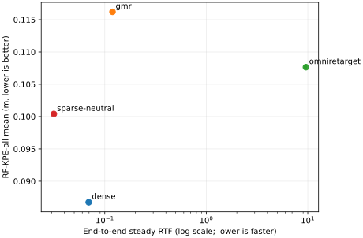
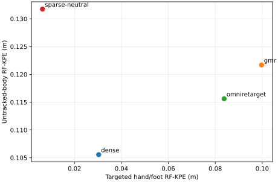
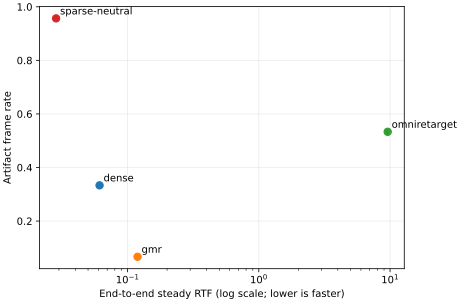
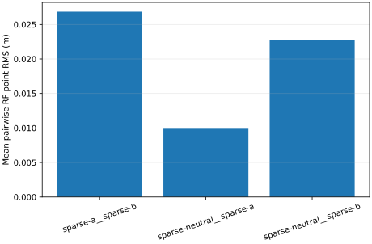
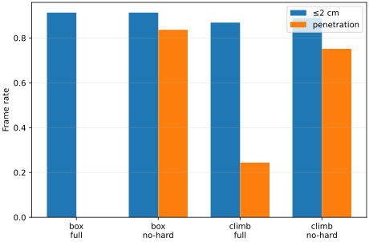

# Human-to-G1 Retargeting Pilot

## 1. Decision

**GO WITH CHANGES** — required Stage 1 Pilot execution and validation are complete; Stage 2 needs a runtime-budget change and explicit approval.

## 2. Question

How do sparse constraints, dense constraints, GMR, and OmniRetarget trade fidelity, artifacts, and speed on one frozen human-motion Pilot?

## 3. Frozen source

One source-only selected LAFAN1 window: 600 frames, 19.9998 seconds, selected before any retargeter ran.

## 4. Controlled baselines

Sparse and Dense share every solver setting. Only the task set changes; Sparse also exposes three deterministic initial postures.

## 5. Public methods

GMR and OmniRetarget run at frozen official commits in isolated subprocess environments with only I/O, provenance, and timing adapters.

## 6. Quality vs speed

## 7. Targeted vs untracked

## 8. Artifacts

## 9. Sparse sensitivity

## 10. Interaction ablation

## 11. Evidence limits

This is one LAFAN operating point and two interaction cases. No dataset-level ranking or controller claim is made.

## 12. Synchronized visual evidence

The Rerun recording provides full articulated G1 meshes in side-by-side world, world overlay, root-frame pose, and Sparse seed views, together with foot-state and per-frame metrics for every canonical output.

## 13. Stage 2 budget

The 1.5× serial projection is 67.95 h and 3.47 GB. Discuss reduced-LAFAN or optimized/parallel execution before approval.

FULL-LAFAN EXPERIMENTS NOT STARTED — WAITING FOR USER APPROVAL.
