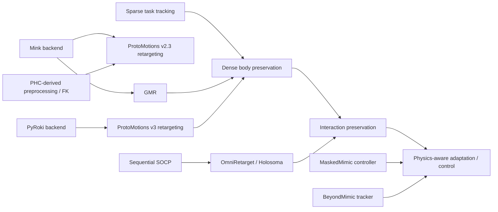

# Lineage evidence

The graph separates three axes: computational backend, optimization abstraction,
and information content. Edges mean a documented implementation or conceptual
dependency; they do not imply identical evaluation conditions.

The graph is an evidence map, not a performance ranking.
